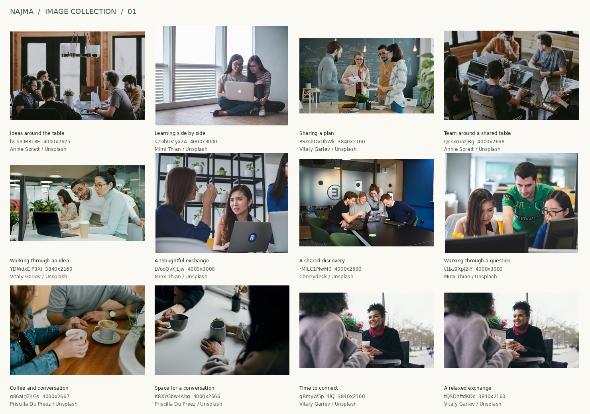
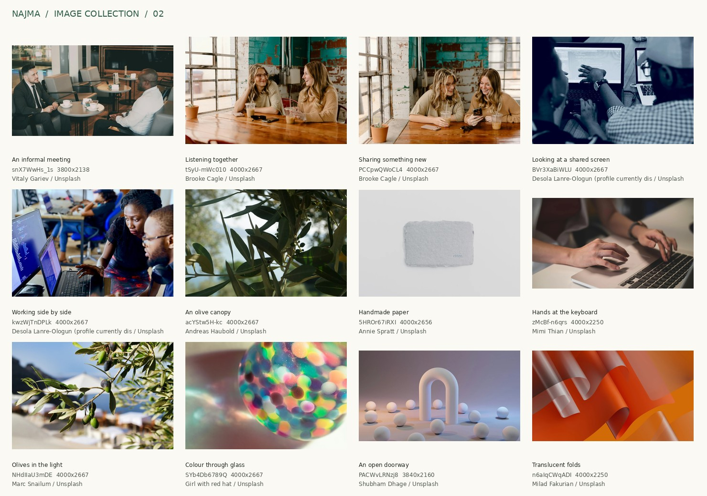
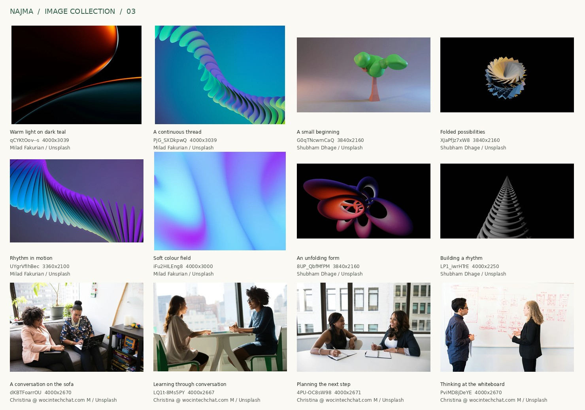
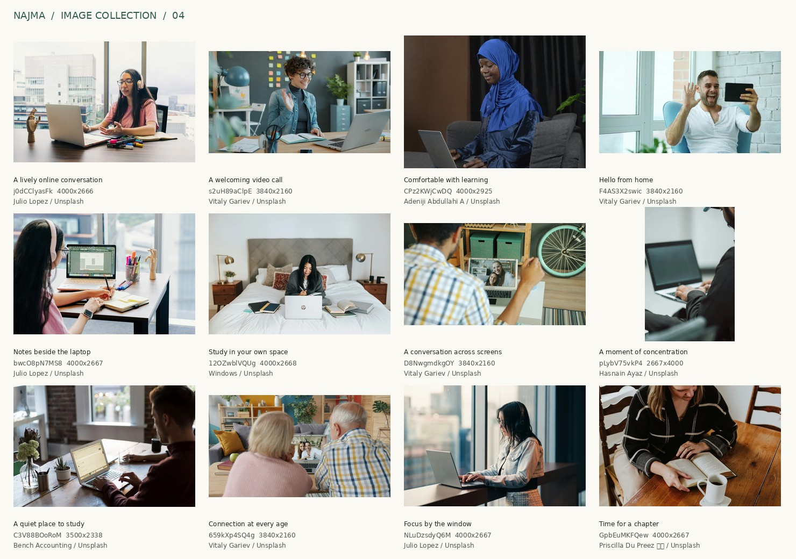
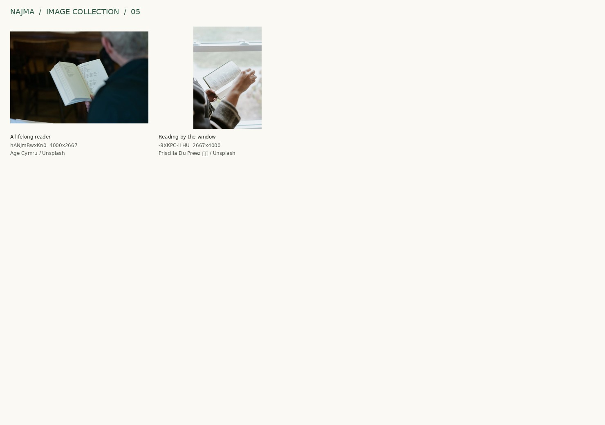

# Najma stock-image collection

**50 carefully selected assets: 40 photographs and 10 abstract illustrations.** Each asset has a large JPEG master and two locally stored WebP versions. The collection was prepared on 25 September 2026 for the Najma website.

[Open the visual catalogue](catalogue.html) after opening the repository locally. It works offline. Use the search field to find a scene or a suggested page. GitHub displays the HTML source; the contact sheets below provide previews directly in GitHub.

## Start here

| Resource | Purpose |
| --- | --- |
| [Visual catalogue](catalogue.html) | Browse all 50 assets with placement notes and direct file links |
| [manifest.json](manifest.json) | Exact file paths, dimensions, checksums, alt text and suggested placements |
| [credits.csv](credits.csv) | Creator credits and original source pages |
| [Pexels shortlist](PEXELS-SHORTLIST.md) | Optional alternatives whose downloads were blocked during this session |
| `masters/` | Large JPEG source assets for cropping and new exports |
| `web/` | 960 px and 1920 px wide WebP versions, plus larger exports where the website needs them |

## Visual direction

Lead with people engaged in a recognisable learning activity. Use generous landscape photography with warm daylight and believable interactions. The collection includes several quieter details for moments when a face would compete with the page's information.

Najma's forest green works particularly well beside natural wood and pale backgrounds. The warm translucent-fold illustration and dark teal/orange abstract provide another route for a prominent accent section. Blue and violet artwork supplies optional alternatives. Choose a consistent subset for each page.

Let the photograph occupy a substantial editorial area. Place headings and reading copy beside it where possible. Use Material 3 shape and colour roles already present in the repository. Keep interface icons within the existing Google Material Symbols system.

This addition supplied assets for a design pass that kept the website copy as it was. The copy has since been rewritten to the standard in `VOICE.md` at the repository root.

## Suggested first choices

IDs are searchable in the catalogue and manifest. All placement suggestions are editorial starting points.

| Page or section | First choices | Why they suit the page |
| --- | --- | --- |
| Home | `j0dCClyasFk`, `s2uH89aClpE`, `CPz2KWjCwDQ` | Welcoming online interaction with clear expressions |
| Private lessons | `LQ1t-8Ms5PY`, `4PU-OC8sW98`, `bwcO8pN7MS8` | Conversation, shared planning and independent practice |
| Flexible study | `12OZwblVQUg`, `GpbEuMKFQew`, `s2DbUV-yx2A` | Comfortable learning environments and readable compositions |
| Organisations | `QckxruozjRg`, `PSksbOVDhWk`, `YDWdxElP3XI` | Shared attention and collaborative work |
| Solidarity Café | `gRmyW5p_4lQ`, `K8XYGbw4Ahg`, `F4AS3X2swic` | Conversation and remote connection |
| About the collective | `dKBTFoarrOU`, `hCb3lIB8L8E`, `PACWvLRNzj8` | Collegiality and a calm conceptual opening |
| Dark accent section | `qCYKtOov--s`, `LP1_iwrHTrE` | Generous dark space and sculptural form |
| Warm accent section | `n6aIqCWqADI` | Translucent layers and a warm colour field |

Several scenes have complementary frames. Choose one dominant frame from a series within a page. Assets marked `reserve` have a narrower fit, such as visible technical screens or workplace branding. Their placement notes explain the trade-off.

## Image quality and sizing

All 50 masters were decoded and inspected. Their longest edges range from **3,360 to 4,000 pixels**. Their shortest edges are at least **2,100 pixels**. Original source dimensions are recorded separately; the largest source is over 7,900 pixels wide.

The original aspect ratio is preserved. Sources larger than 4,000 pixels on the long edge were downsampled using Lanczos resampling. Every stored image is at or below its source resolution. Masters use JPEG quality 93 with full chroma resolution. Web exports use WebP quality 88.

The two WebP variants are **960 px** and **1920 px** wide. Use the large master when a layout needs more pixels. Create additional WebP exports from the master when a full-width hero needs an intermediate size: `python3 tools/export_stock_sizes.py ID:WIDTH` uses the same settings and records each new file in the manifest. The photographs the website draws wider than 960 CSS pixels have 2560 px exports, and two have 3200 px exports.

For a crisp 2× display, supply at least twice the rendered CSS width. A 1920 px image therefore supports a 960 CSS-pixel-wide uncropped display. A 4000 px master supports a 2000 CSS-pixel-wide uncropped display. Cropping reduces the usable pixel area, so calculate against the retained crop.

For example, a 1440 × 600 CSS-pixel hero at 2× needs a retained crop of at least 2880 × 1200 pixels. Select a landscape master that supports that crop. Portrait assets suit vertical panels.

Use real width descriptors in `srcset`. Set `sizes` to the intended layout. Include the image's intrinsic `width` and `height` to reserve space. Eager-load the lead hero; lazy-load imagery farther down the page.

```html

```

The `initial_object_position` values in the manifest start at the centre. Review each final crop at the actual mobile and desktop breakpoints. The catalogue shows each complete image for inspection.

## Context and credit

All included assets come from **Unsplash**. Each selected source offered a free download during curation. The [Unsplash License](https://unsplash.com/license) covers the assets. Retain the source records so future editors can inspect the original context and current terms.

Stock subjects appear as illustrative models. Named teacher profiles require those teachers' approved photographs. Partner and beneficiary claims require photographs approved for those specific organisations. Keep the existing teacher photographs associated with their verified records.

The physical café scenes illustrate conversation. Najma's Solidarity Café meets online. The olive photographs were taken in Greece and Italy respectively; their use is botanical symbolism. Each relevant asset has a placement note.

The illustration set consists of abstract digital artwork and 3D renders. Interface icons should continue to use Google's Material Symbols. The collection introduces no additional icon library or UI framework.

Pexels blocked both the download client and browser during this session. Its optional shortlist remains separate and contains source links only.

## Verify the files

Run from the repository root:

```sh
python3 tools/validate_stock_assets.py
```

The validator uses Python's standard library. It checks every asset's byte count and SHA-256 hash. It also checks that master dimensions meet the resolution threshold and stay within recorded source dimensions. The initial quality review additionally decoded every JPEG and WebP with Pillow.

## Contact sheets

The sheets show complete images, source IDs and creator credits. Use the individual master or WebP files for website implementation.










